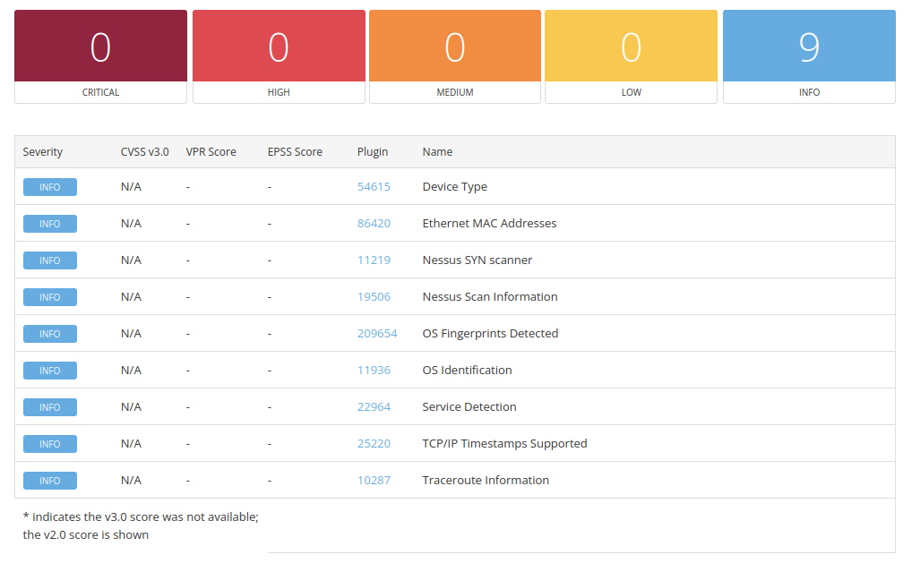

# iPhone Vulnerability Assessment

## Overview

This assessment evaluates the security posture of an iPhone on the network. The objective was to identify vulnerabilities, determine root causes, apply remediation, and validate the effectiveness of those fixes.

---

## Environment
- **Target Operating System:** iOS 26.3.1

---

## Initial Scan

## Main Takeaways
- No vulnerabilities were identified
- Limited results due to absence of exposed services and lack of authenticated access
