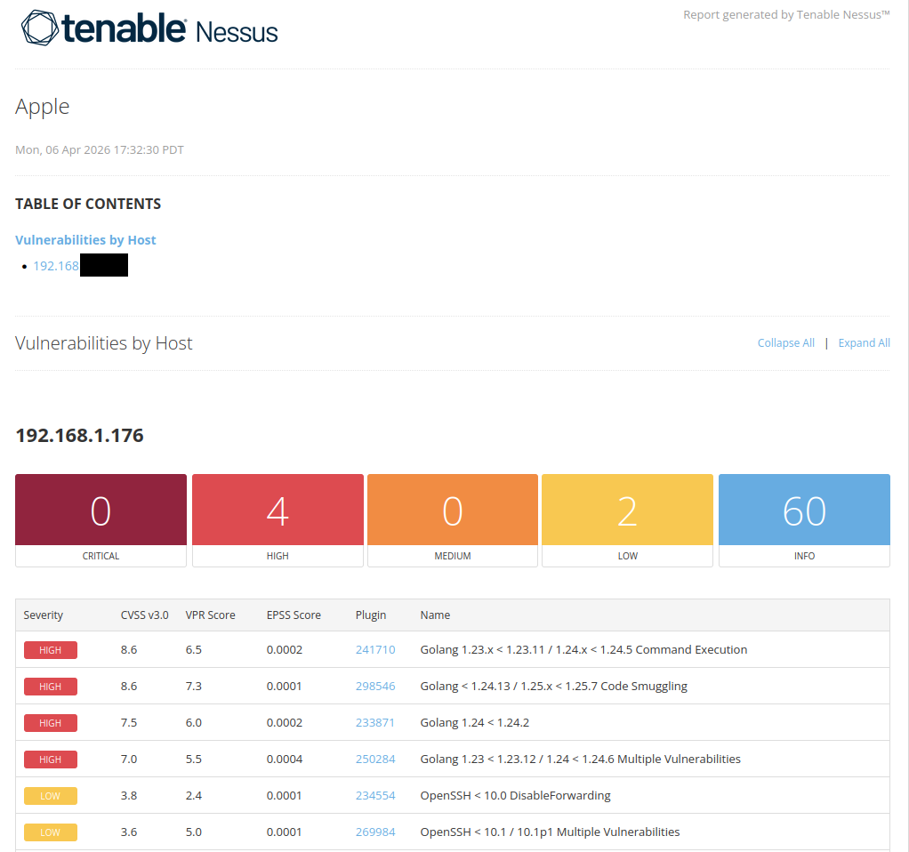
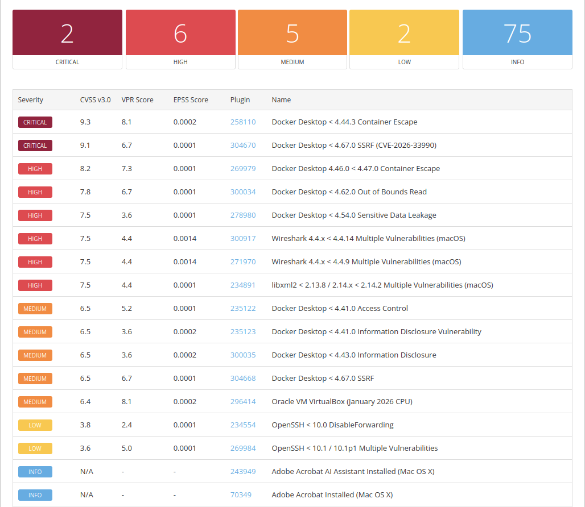
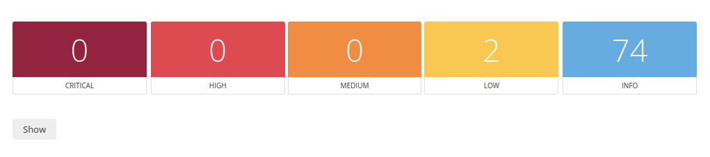

# Macbook Vulnerability Assessment

## Overview

This assessment evaluates the security posture of a Macbook host on the network. The objective was to identify vulnerabilities, determine root causes, apply remediation, and validate the effectiveness of those fixes.

---

## Environment
- **Target Operating System:** MacOS Sequoia 15.7.5 

---

## Methodology
1. Conduct initial vulnerability assessment
2. Analyze and prioritize findings by severity
3. Identify root causes
4. Apply patches
5. Re-assess to validate remediation

---

## Results

### Initial Scan
- **High:** 4
- **Low:** 2 

---

### Second Scan 
- **Critical:** 2
- **High:** 6
- **Medium:** 5
- **Low:** 2

---

### Final Scan
- **Critical:** 0
- **High:** 0
- **Medium:** 0
- **Low:** 2

## Key Findings
- **Outdated Software**
The majority of high-severity vulnerabilities were caused by outdated third-party software (e.g., Docker Desktop, Go, Wireshark, VirtualBox, libxml2).
- **OpenSSH**
A low-severity finding related to SSH was identified due to Remote Login being enabled for authenticated scanning. This can be mitigated by disabling SSH when not needed. 

---

## Analysis

---

### Remediation
- Updated all identified vulnerable software to patched versions
- Remote Login will be disabled post-assessment to reduce attack surface

---

### Outcome
- All medium, high, and critical-severity vulnerabilities were resolved
- Remote Login was disabled post-assessment, effectively remediating the low-severity OpenSSH issues

---

## Key Takeaways
- KEEP EVERYTHING UP-TO-DATE
- Keeping software updated reduces vulnerability exposure
- Disable SSH when not needed to reduce attack surface
