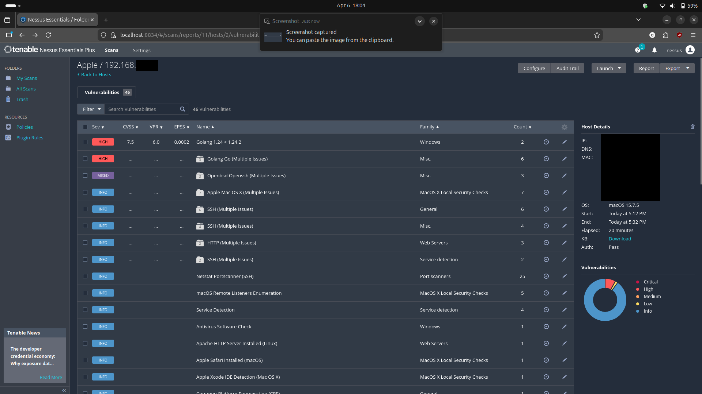

# Macbook Vulnerability Assessment

## Overview
This assessment evaluates the security posture of a Macbook host on the network. The objective was to identify vulnerabilities, determine root causes, apply remediation, and validate the effectiveness of those fixes.
---

## Environment
- Target Operating System: MacOS Sequoia 15.7.5 

---

## Methodology
1. Conduct initial vulnerability assessment
2. Analyze and prioritize findings by severity
3. Identify root causes
4. Apply patches
5. Re-assess to validate remediation

---

## Results

### Before Remediation
- High: 4
- Low: 2 

---

### After Remediation
- Critical:  
- High:  
- Medium:  

---

## Key Findings
- **Outdated Go Software**
The high-severity vulnerabilities were due to an outdated version of Go. These were remediated through software updates.
- **OpenSSH**
The OpenSSH issue is low-severity. Furthermore, the vulnerability can be remediated by turning off remote login on the macbook. Remote login (SSH) was temporarily enabled to allow Nessus to perform an authenticated scan. 

---

## Analysis

### Initial Findings
The assessment identified multiple low-severity and high-severity vulnerabilities. Review of individual findings revealed that the issues were associated with outdated software 

---

### Root Cause
The most severe vulnerabilities were caused by outdated software. The low-severity vulnerabilities were due to a temporary enabling of SSH for Nessus to perform authenticated vulnerability scanning.
---

### Remediation
- Updating Go software to the latest version
- As for the SSH issue, I will disable remote login on the macbook after this assessment

---

### Outcome
- All high-severity vulnerabilities were resolved
- 
-  

---

## Key Takeaways
-  
-  
-  
