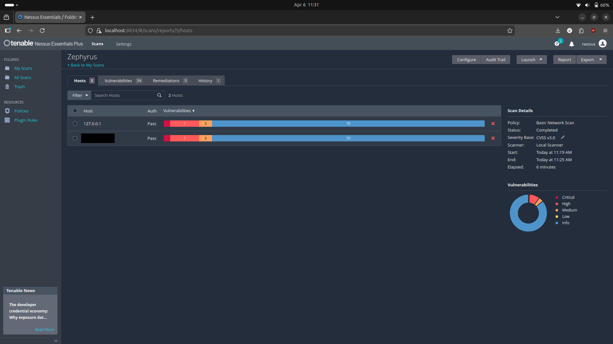

- OS: Ubuntu 24.04
- Target: Local host (127.0.0.1)

## Methodology
1. Initial scan
2. Identify vulnerabilities
3. Apply patches
4. Re-scan and validate remediation

## Results
- Before: Critical (1), High(7), Medium (1)

- After: Critical (0), High (0), Medium (1)

## Key Findings
- Outdated packages -> resolved via ESM
- SSL self-signed cert -> expected & low risk as it is not exposed externally

## Takeaways
- Not all scanner findings require remediation
