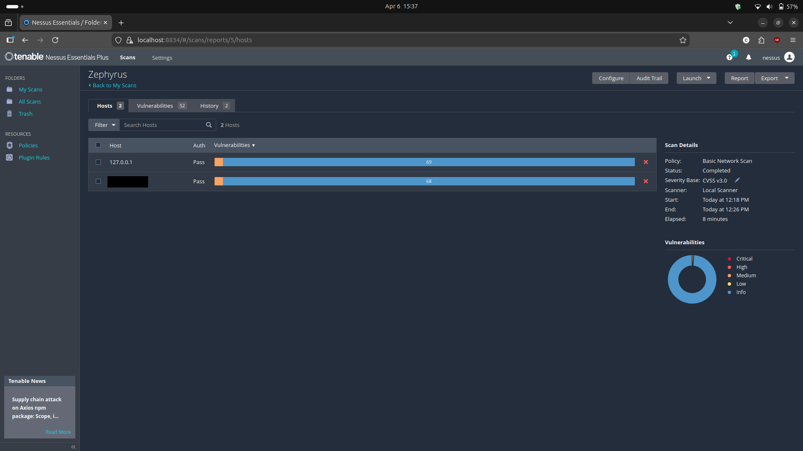
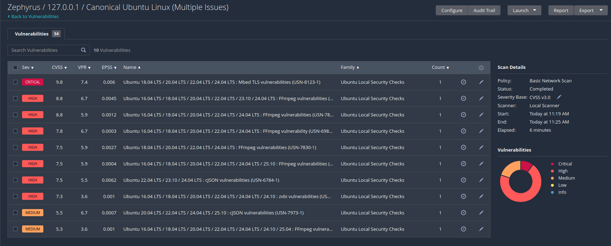

# Ubuntu Desktop Vulnerability Assessment

## Overview
This assessment evaluates the security posture of a local Ubuntu host. The objective was to identify vulnerabilities, determine root causes, apply remediation, and validate the effectiveness of those fixes.

---

## Environment
- **Operating System:** Ubuntu 24.04  
- **Target:** Localhost (127.0.0.1)

---

## Methodology
1. Conduct initial vulnerability assessment  
2. Analyze and prioritize findings by severity  
3. Identify root causes  
4. Apply remediation measures  
5. Re-assess to validate remediation 

---

## Results

### Before Remediation
- **Critical:** 1 
- **High:** 7
- **Medium:** 3

---

### After Remediation
- **Critical:** 0  
- **High:** 0  
- **Medium:** 1  

---

## Key Findings

- **Outdated System Packages**  
  The majority of identified vulnerabilities were due to outdated packages. These were remediated through extended security updates.

- **Self-Signed SSL Certificate**  
  A self-signed certificate was detected on a local service. This is expected behavior and presents minimal risk as the service is not externally exposed.

---

## Analysis

### Initial Findings
The assessment identified multiple medium to critical vulnerabilities. Review of individual findings showed that most issues were associated with outdated packages.

---

### Root Cause
Standard update mechanisms did not apply all available security patches. Certain updates fall under extended security maintenance and are not enabled by default.

---

### Remediation
Remediation actions included:

- Enabling extended security updates  
- Applying all available patches  
- Rebooting the system to ensure updates were effective  

---

### Outcome
Following remediation:

- All critical vulnerabilities were resolved  
- All high-severity vulnerabilities were resolved  
- Remaining findings were limited to low/medium or informational items  

---

## Key Takeaways
- Effective patch management significantly reduces vulnerability exposure  
- Severity ratings require contextual interpretation based on system exposure  
- Validation through re-assessment is essential to confirm remediation effectiveness  
